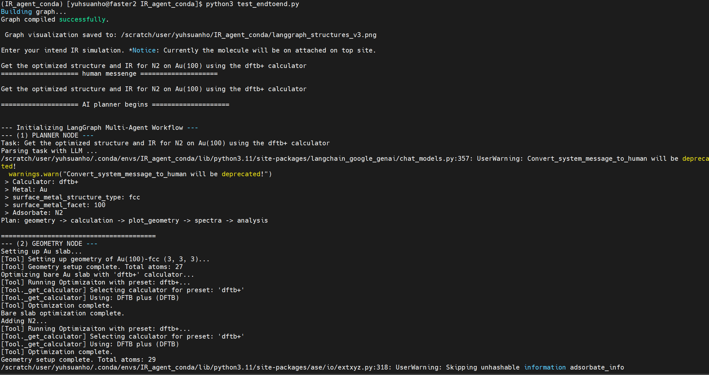
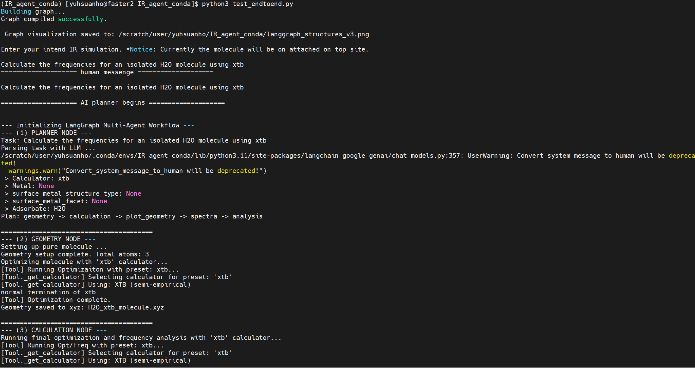
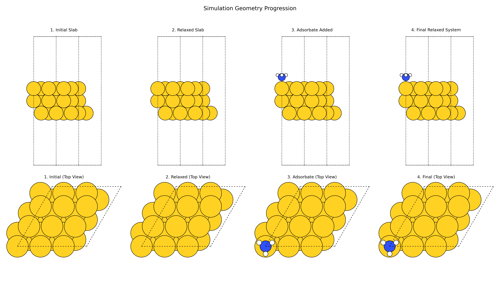
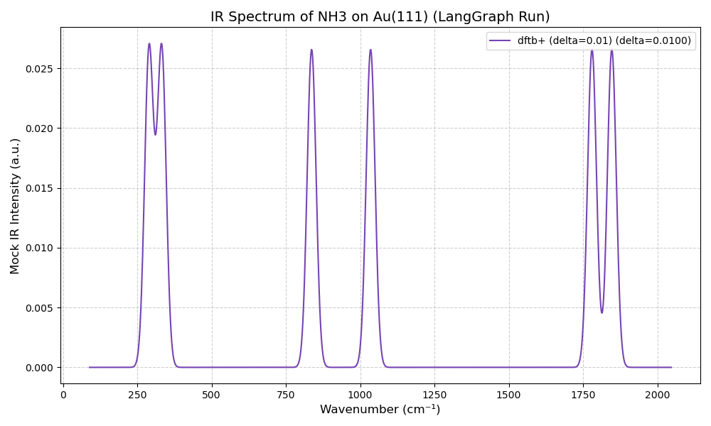
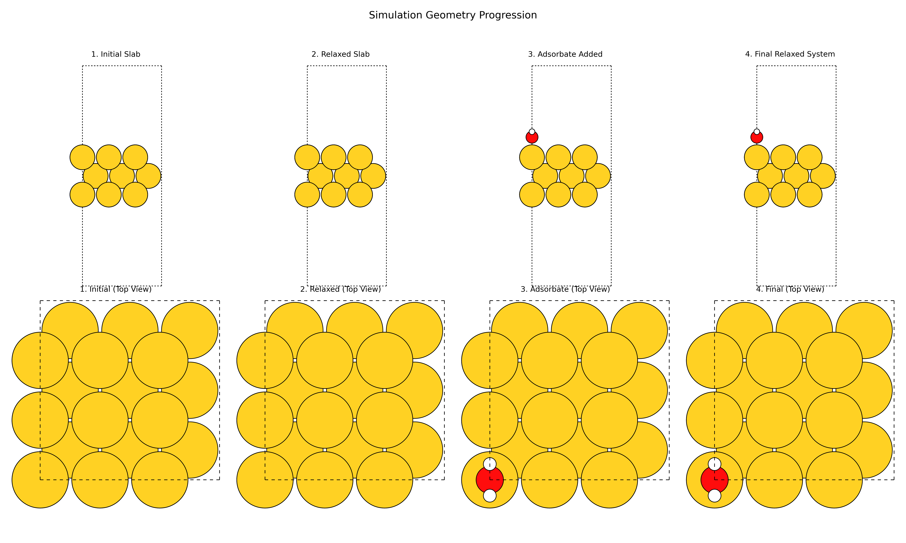
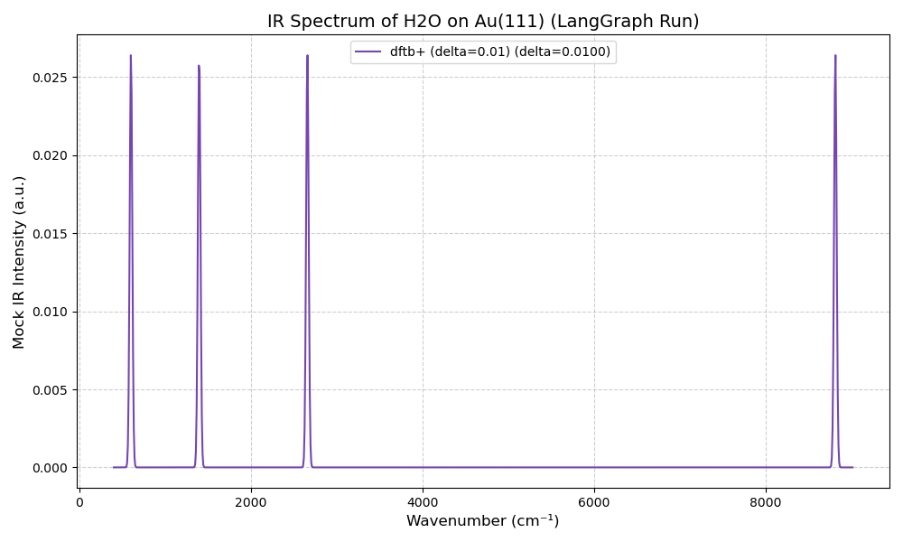

# IR_agent_conda 
LangGraph Computational Chemistry Agent for OPT and IR calculation


## 1. INTRODUCTION
This project implements a multi-agent workflow using LangGraph to automate computational chemistry simulations with the Atomic Simulation Environment (ASE). The system is designed to take a high-level, natural-language task (e.g., "Run a fast IR spectrum simulation for water on Au(111)") and execute a full pipeline:

1.  **Plan:** An LLM (Gemini) parses the request to determine simulation parameters.

2.  **Execute:** A series of tools build the atomic structures, run optimizations, and calculate vibrational frequencies using various calculators with ASE package. (includes EMT, xTB, TBLite, GPAW, DFTB+, VASP).   
    - Notice: xtb is not supported for adsorption system, and VASP ase wrapper are not tested, and will be future project

3.  **Analyze:** The system generates plots for the structures and spectra, and a final LLM-powered agent provides a human-readable summary of the results.

This framework is built to be a modular and extensible platform for automating repetitive computational tasks in materials science and chemistry.


## 2. CORE FEATURES

* Natural Language Interface: Control complex simulations with simple text prompts.
* Multi-Calculator Support: Easily switch between different computational methods:
    * `'fast'`: **EMT** (Effective Medium Theory) - A very fast, low-accuracy mock calculator.
    * `'xtb'`: **GFN2-xTB** (via `xtb_ase`) - A fast, semi-empirical tight-binding method.
    * `'tblite'`: **GFN1-xTB** (via `tblite`) - An alternative semi-empirical method.
    * `'dftb+'`: **DFTB+** (via `ase.calculators.dftb`) - A semi-empirical density-functional tight-binding method.
    * `'gpaw'`: **GPAW** - A grid-based DFT calculator.
    * `'NWChem'`: **GPAW** - A gaussain type / plane-wave DFT calculator.
    * `'default'`/`'accurate'`: **VASP** - A high-accuracy, plane-wave DFT code (requires proper environment setup).
* Automated Structure Generation:
    * Surfaces: Supports fcc, bcc, and hcp slabs with common facets (e.g., fcc111, bcc110, hcp0001).
    * Adsorption: Automatically places molecules on slabs with appropriate constraints.
    * Molecules: Handles isolated molecules in a vacuum box.
* End-to-End Calculations: Performs a full geometry optimization (BFGSLineSearch) followed by a vibrational frequency analysis.
* Automatic Reporting: Generates and saves comparison plots of atomic structures and (mock) IR spectra.
* AI-Powered Analysis: An agent provides a final text summary of the numerical results.


### 3. HOW IT WORKS: AGENT ARCHITECTURE

This repository is split into five main components: `simulation_tools.py`, `postprocess_tools.py`, `planner.py`, `build_graph.py`, and `test_endtoend.py`.

---

### `simulation_tools.py` (The "DFTB/DFT Tools")

This file contains a library of Python functions decorated with `@tool` that wrap complex **ASE (Atomic Simulation Environment)** operations into simple, discrete steps.

* **Calculator Selection (`_get_calculator`)**: A robust helper function that selects and initializes an ASE calculator based on a preset.
    * `'fast'`: **EMT** (Effective Medium Theory) - A very fast, low-accuracy mock calculator.
    * `'xtb'`: **GFN2-xTB** (via `xtb_ase`) - A fast, semi-empirical tight-binding method.
    * `'tblite'`: **GFN1-xTB** (via `tblite`) - An alternative semi-empirical method.
    * `'dftb+'`: **DFTB+** (via `ase.calculators.dftb`) - A semi-empirical density-functional tight-binding method.
    * `'gpaw'`: **GPAW** - A grid-based DFT calculator.
    * `'nwchem'`: **NWChem** - A high-performance computational chemistry package.
    * `'default'`/`'accurate'`: **VASP** - A high-accuracy, plane-wave DFT code (requires proper environment setup).
* **Structure Building**:
    * `setup_slab_tool`: Constructs `fcc`, `bcc`, and `hcp` metal slabs with specified facets.
    * `setup_molecule_tool`: Creates an isolated molecule in a vacuum box.
    * `setup_adsorbate_tool`: Places a molecule on a slab and applies `FixAtoms` constraints to the bottom layers.
* **Calculation Execution**:
    * `run_opt_tool`: Performs geometry optimization using the `BFGSLineSearch` algorithm.
    * `run_opt_freq_tool`: Runs a final, high-force-tolerance optimization (`LBFGS`) followed by a `Vibrations` analysis to get frequencies.

---

### `postprocess_tools.py` (The "Analysis/Visualization Tools")

This file contains the tools responsible for plotting and visualizing the results from the simulation.

* **`extract_and_plot_spectra_tool`**: Extracts vibrational frequencies, converts them to `cm⁻¹`, and plots a broadened Gaussian IR spectrum. **(Note: Intensities are mocked)** for calculators that don't provide dipole moments.
* **`plot_structure_comparison_tool`**: Generates a 2x4 comparison plot showing the system at four key stages (initial slab, relaxed slab, adsorbate added, final system) from both side and top-down views.

---

### `planner.py` (The "Agent Nodes")

This file defines the "memory" and all the individual "agent" functions (nodes) for the LangGraph workflow.

* **`SimulationState`**: A `TypedDict` that acts as the shared state for the graph, passing atom objects, calculator settings, and results between nodes.
* **LLM Integration**:
    * Uses `ChatGoogleGenerG` (Gemini) for its agentic components.
    * A `structured_llm` is bound to a Pydantic model (`PlannerOutput`) to force the planning LLM to return a clean, parsable JSON object.
* **Agent Nodes**: Each step in the workflow is a function that modifies the state.
    1.  **`planner_node`**: The entry point. Takes the user's `task` string and uses the `structured_llm` to extract `calculator_level`, `surface_metal`, `adsorbate_formula`, etc.
    2.  **`geometry_node`**: Uses the plan from the state to call the correct `simulation_tools` functions to build and pre-optimize the slab/adsorbate system. It includes logic to handle "pure molecule" calculations if the metal is set to 'None'.
    3.  **`calculation_node`**: Takes the final geometry and runs the `run_opt_freq_tool` to perform the computationally expensive frequency calculation.
    4.  **`plot_geometry_node`**: Calls `postprocess_tools.plot_structure_comparison_tool` to generate and save the structure comparison plot.
    5.  **`spectra_node`**: Calls `postprocess_tools.extract_and_plot_spectra_tool` to generate and save the IR spectrum plot.
    6.  **`analysis_node`**: Takes the final numerical frequency data, packages it, and sends it to an LLM to generate a final, human-readable summary, which it saves to a text file.

---

### `build_graph.py` (The "Agent Orchestrator")

This file imports the nodes from `planner.py` and wires them together into a `StateGraph`.

* **Graph Definition**: The nodes are wired into a fixed, linear sequence:
    `PLANNER` → `GEOMETRY` → `CALCULATION` → `PLOT_GEOMETRY` → `SPECTRA` → `ANALYSIS` → `END`
* **Compilation**: It compiles this graph into a runnable `app` object, which is then imported by `test_endtoend.py`.

---

### `test_endtoend.py` (The "Main")

This is the main executable file to run the entire workflow.

* **Imports**: It imports the compiled `app` object from `build_graph.py`.
* **Task Definition**: A user's task (e.g., "Run a IR spectrum simulation for N2 on Au(111)...") is defined as the `initial_task` string.
* **Execution**: It initializes the graph with this task and uses `app.stream()` to run all the nodes in the defined sequence.
* **Output**: It prints the final `analysis_report` from the graph's state upon completion.


## 4. INSTALLATION AND SETUP

This guide assumes a Linux-based environment.

Prerequisites

* Anaconda or Miniconda
* Git
* (For Linux) A GCC compiler (e.g., `module load GCC/12.3.0` on a cluster)

## Step 1: Conda Environment Setup


### Clone this repo
    git clone https://github.com/ryanlai666/IR_agent_conda.git [This_REPO_URL]
    cd IR_agent_conda


###  Create the conda environment

It is recommended to set up a conda environment and installing dependency through conda-forge.

- Anaconda version used in this project is `Anaconda3/2024.02-1` 

Type following command in Anaconda_prompt or in activate conda base to create  new conda enviroment. `IR_agent_conda` are the new created conda enviroment that can be changed.
```bash
conda create --name IR_agent_conda python=3.11
conda activate IR_agent_conda
```

- ### windows (vscode & git bash)

Add the following path to your windows environment variable 
``` 
# for windows
C:\ProgramData\anaconda3
C:\ProgramData\anaconda3\Scripts
C:\ProgramData\anaconda3\Library\bin
```
Conda init should add the will add the coressponding bash enviroment 
```bash
# for windows
conda init bash
conda activate IR_agent_conda
```

- ### linux
You can activate the environment from bash
```bash 
conda env list
conda init ## will add corresponding export path to .vimrc
conda activate IR_agent_conda
```


### Step 2: Install Python Dependencies

- ####  Install the core packages requirement through conda-forge 
```bash 
conda install matplotlib
conda install conda-forge::ase

```

- #### Install  LangChain / LangGraph and Gemini API

```bash 
conda install -c https://prefix.dev/conda-forge python-dotenv
conda install conda-forge::langchain-core 
conda install conda-forge::langgraph

# I only have access of Gemini API, so I use gemini, other API should be easier to swap with.
conda install conda-forge::langchain-google-genai
```

### Step 3: Set Up API Key

Create a `.env` file in the root directory of the project and add your Google API key:

    GOOGLE_API_KEY="YOUR_API_KEY_HERE"


### Step 4: Install External Calculators (DFT/DFTB packages Installation)

This agent *orchestrates* calculators; it does not *include* them. You must install the ones you intend to use.
To make it simipe, I mainly selected ASE calculator supported package as start. 
The Supported calculators of ASE could be checked in following link: [Supported calculators of ASE](https://ase-lib.org/ase/calculators/calculators.html)

However, most of packages listed are not easily accessible through conda install, and very few supported PBC system. Therefoere, this project merely includes:

- **1. EMT** : EMT is built-in with ASE. No installation is needed.  (bad performance)

- **2. DFTB+ (Recommended)**: We recommend installing via `mamba` for easier dependency resolution.

- **3. GPAW**: Install via `conda-forge`

- **4. xTB (For Molecules Only)**: Note: The `xtb_ase` wrapper does not support Periodic Boundary Conditions (PBC) and will fail for slab systems. It is suitable for isolated molecule calculations.

- **5. NWChem** Install via `micromamba`:

- **6. tblite**  (version contradict with stable DFTB+ version, so skipped for now)
## 


As for Vasp Wrap through ASE python wrapper should be the next step plan that integrate with the HPC system.

Besides, to satisify the requirement of the project:

**All computation must be reproducible on a standard laptop**. 

And, I don't have the Vasp pacakges available locally due to license policy, so I am unable to test to integrate it to obtain better accracy IR, and the mocked calculation is not worth to represent the accracy, so I didn't try out working with VASP. However, it sould be more strightfoward to incoperate VASP pacakge first in practical HPC usage.

### 2-a. DFTB+ Installation through conda (failed)
Followed website DFTB+ website but failed. https://dftbplus.org/download/stable.html
```bash 
# Failed installation route through conda
# 
conda install -c conda-forge gsl  (2.5.0 version will be too new, not worked)
conda install gsl=2.7.0 #(add this dependency but still failed)
conda install conda-forge::dftbplus=24.1=nompi_*       #(failed)
# supported package
conda install conda-forge::dftbplus-tools=24.1  (not sure)
conda install conda-forge::dftbplus-python=24.1 (not sure)
```
### 2-b. DFTB+ Installation through mamba (success)
Install DFTB+ by mamba as [Introduction — DFTB+ Recipes](https://dftbplus-recipes.readthedocs.io/en/latest/introduction.html) suggested:
```bash
conda install conda-forge::mamba  # install mamba through conda

# below is non-mpi version, but mpi version is also avialable
mamba install 'dftbplus=*=nompi_*'  # then utilzie mamba install dftbplus
mamba install dftbplus-tools dftbplus-python
```
Then, add the DFTB+ path like `~/.conda/envs/IR_agent_conda/bin/dftb+` enviroment to your .vimrc and refresh the bash.

For the parameters of Slater-Koster files needed for differnt required elements, please downlaod from https://www.dftb.org/parameters/download.html, and check https://dftb.org/parameters/introduction.html for further details.

For compatibility, also the old variable can be used, and the resulting command will be . Before each DFTB+ calculation, also make sure that the variable points to the directory where the Slater-Koster files are kept. 
Please check https://ase-lib.org/ase/calculators/dftb.html for more details on its enviorments setup.

For current DFTB parameter used. please change the DFTB+ prefex in your .vimrc to export the correct parameters path.
3ob-3.1.0, auorgap zips are included.
```bash
export DFTB_PREFIX= YOUR_PARAMETERS_PATH/IR_agent_conda/3ob-3.1.0/skfiles/
```
For this adsorption project, these two paraneters set are already included in the root diretories, please exported the needed parameters
- auorgap : includes Au - Au,H,C,N,O,S,P (gold-thiolate compounds + extension of auorg with P)  ## current dftb+ results

- 3ob : includes Br-C-Ca-Cl-F-H-I-K-Mg-N-Na-O-P-S-Zn (DFTB3 files for bio and organic molecules) 

notice

### 3. NWChem Installation
Follow below instruction from NWChem website: 
[How to download and install NWChem - NWChem](https://nwchemgit.github.io/Download.html#example-of-nwchem-rpm-installation-under-redhatcentos-7-x86_64)

and install through conda and micromamba as following:
```bash
conda install -c conda-forge micromamba
micromamba install -c conda-forge nwchem
```

### 4. xtb Installation (not supported for PBC system)
more on xtb: https://wires.onlinelibrary.wiley.com/doi/10.1002/wcms.1493

Make sure you have GCC compiler and GFortain installed or loaded
```bash
conda install -c conda-forge libgfortran5  (xtb seems require GFORTRAN_10)
conda install -c conda-forge xtb
```
Install the python wrapper of your selected. ([xtb-python](https://xtb-python.readthedocs.io/en/latest/)/ [xtb_ase](https://andrew-s-rosen.github.io/xtb_ase/user_guide/parameters.html))
```bash
# xtb-python  # (not used for this project, but should work as well)
conda install conda-forge::xtb-python  
 
# xtb_ase (seems to be better xtb ase wrapper) (used for this project)
pip install git+https://github.com/Quantum-Accelerators/xtb_ase.git

```

### 5. GPAW Installation 
Follow below instruction from GPAW website: 
[How to download and install GPAW](https://gpaw.readthedocs.io/install.html)
Instead of using pip, using conda install conda-forge channel to ensure dependency
```bash
conda install conda-forge::gpaw
```

### 6. tblite Installation
Follow below instruction from tabite repo and install with mamba: 
[tblite repo](https://github.com/tblite/tblite)

If the conda-forge channel is not yet enabled, add it to your channels with
```bash
mamba config --add channels conda-forge
mamba config --set channel_priority strict
```
Once the conda-forge channel has been enabled, this project can be installed with:
```bash
mamba install tblite
# If you want to enable the Python API as well install
mamba install tblite-python
```
However, the installed dftbplus is 24.1, and tbilte utlized 20.2.1 version, so install of tblite will downgrade the dftplus version, which might casues dependency issue\\
. Therefore, I did not expand the tblite wrapper in this project.


### Step 5: Verify Installation


Test scripts for each calculator are provided in the `package_tester/` directory. Run them to ensure your environment and calculators are correctly configured.

    # Example for DFTB+
    python package_tester/dftbplus/dftbplus_test.py

    # Example for GPAW
    python package_tester/GPAW/gpaw_test.py


## 5. USAGE


To run the agent, execute the `test_endtoend.py` script. The script will prompt you to enter your simulation task.

    # Make sure your conda environment is active, and include GCC compiler
    conda activate IR_agent_conda

    # Run the IR agent
    python test_endtoend.py


You will then be prompted in your terminal:  (if set `Take_task_from_user`=`True` in `test_endtoend.py` )

    Enter your intend IR simulation, Notice: currently the molecule will be on attached on top site.:

Example Prompts:

```bash
## slab with adsorbate
* "Run a fast IR spectrum simulation for water on Au(111)"
* "Get the optimized structure and IR for water on Au(100) using the dftb+ calculator"  ### take ~ 10 mins
* "Get the optimized structure and NH3 for NH3 on Au(111) using the dftb+ calculator"  ### take ~ 15 mins 
* "Get the optimized structure and IR for N2 on Au(100) using the dftb+ calculator"     ### take ~ few mins

## pure molecule
* "Calculate the frequencies for an isolated H2O molecule using xtb"
```


- Example of slab with adsorbate:
  


- Example of pure molecule:
  


###  Notice:

If set `Take_task_from_user`=`False` in `test_endtoend.py`, initial_task = "XXXXXX" in main function will be use as argument


### 📈 Calculator Performance Summary: Single-Core Benchmark. 

The following table summarizes the approximate performance of implemented calculators for a **single-core run** on a test system of approximately 30 atoms. (~350 electrons).

| Calculator | Implemented? | Speed | Slab Opt. Accuracy | Molecule Opt. Accuracy | IR Accuracy |
| :--- | :---: | :--- | :--- | :--- | :--- |
| `'fast'` (EMT) | ✅ | Very Fast | Bad ~ OK | Bad ~ OK | Very Bad |
| `'xtb'` (GFN2-xTB) | ✅ | Very Fast | Bad | OK | Very Bad ~ Bad |
| `'dftb+'` (DFTB+) | ✅ | Medium | OK | OK | Bad |
| `'gpaw'` (GPAW) | ✅ | Slow | Good | Good | ? (Too long) |
| `'NWChem'` | ✅ | Very Slow | Good | Good | ? (Too long) |
| `'default'`/`'accurate'` (VASP) | Partial | Very Slow | Good | Good | Medium ~ good |
| `'tb-Lite'` | ❌ | ? | ? | ? | ? |

### Important Notes and Limitations

* **Coarse Results:** This table provides only a very coarse idea of performance. The VASP results are based on past experience, not this specific benchmark.
* **Rough IR Results** Current example results provides coarse vibration calculations, which did not include the dipole moment induced IR active/inactive on Intensities. Therefore, all vibrations mode will be considered as IR.
* **No Parallel Processing:** The current DFT/DFTB package installations do not include MPI/OpenMP support, or it is not enabled in the ASE calculator settings.
* **Performance Bottleneck:** As a result of being limited to a single core, completing calculations with computationally demanding packages like **GPAW** and **NWChem** is very difficult.
* **xTB Limitations:** The current `xtb` calculator implementation only supports molecular calculations (it does not support Periodic Boundary Conditions, or PBC, for slabs).


Output

The agent will stream its progress to the console. Final results, including plots and trajectories, will be saved in the `results/` directory.

* [system_name]_structures.png: A comparison of the initial and final atomic structures.
* [system_name]_ir.png: The calculated IR spectrum. (current result should be quite inaccurate (fast(EMT), dftb+, xtb result.))
* [system_name]_report.txt: summary from AI agent.
* Log files and trajectories: (e.g., `.log`, `.traj`) are saved in the root directory for debugging shown in root directory.
* [system_name]_slab.xyz : (e.g., `.xyz`) optimized structure  are saved in the root directory for further examination or usage.


- #### N2_on_Au_fcc_111_fast(EMT)
- Example of EMT(fast) [system_name]_structures.png :


- Example of EMT(fast) [system_name]_ir.png :


- #### NH3_on_Au_fcc_111_dftb+
- Example of dftb+ [system_name]_structures.png :


- Example of dftb+ [system_name]_ir.png :



- #### H2O_on_Au_fcc_100_dftb+
- Example of dftb+ [system_name]_structures.png :


- Example of dftb+ [system_name]_ir.png :


---

### ASE DFT geometry optimizers selection recommendation


Based on the observation from https://doublelayer.eu/vilab/tag/gpaw/ from Vladislav Ivanistsev's research blog.

- Observation 1. QuasiNewton outperforms all other optimizers. Point. I have run a standard GPAW/DFT/PBE/PW optimization with various optimizers:

- Observation 2. Pre-optimizing the slab with a cheaper method does not reduce the number of optimization steps. I have preoptimized the geometry with TBLITE/DFTB/GFN1-xTB to continue with GPAW/DFT/PBE/PW. Preoptimization takes just some minutes and the obtained geometry looks similar to the DFT one but that does not reduce the number of DFT optimization steps.

Therefore, as QuasiNewton are selected as default and fix parameters for ase calculator to simply the process.


Notice:
In ASE documentaion, https://ase-lib.org/ase/optimize.html#ase.optimize.QuasiNewton

In many of the examples, tests, exercises and tutorials, QuasiNewton is used – it is a synonym for BFGSLineSearch.
Therefore we use BFGSLineSearch as default calculator


-------


## 6.  SCOPE, LIMITATIONS & FUTURE WORK

### Scope
* **Intended Use**: This project is intended for rapid prototyping, and automating simple, repetitive screening tasks (e.g., "what does the spectrum of molecule X look like on metal Y with a fast calculator?").
* **Supported Calculations**: Geometry Optimization and Vibrational Frequency Analysis (for IR spectra). (Finite Difference method)
* **Supported Systems**:
    * Single-molecule adsorption on `fcc`, `bcc`, or `hcp` metal surfaces. 
        * single molecule: includes ASE molecule collections.
        * metal surface and facets includes: 
            * fcc: fcc100, fcc110, fcc111, fcc211
            * bcc: bcc100, bcc110, bcc111 
            * hcp: hcp0001, hcp10m10 
    * Isolated molecules in a vacuum. 

    **Notice:**  xtb calculator generally failed for molecule adsorption task, but should be good for Isolate molecule task.

---

### Limitations

* **Mock IR Intensities**: This is the most significant scientific limitation. The `extract_and_plot_spectra_tool` **does not calculate real IR intensities** (which require dipole moment calculations, e.g., `LEPSILON=.TRUE.` in VASP). It mocks intensities as uniform, so the plot only shows peak *positions* based on the each calculators.
* **Calculator Dependencies**: This code *orchestrates* calculators but does not *include* them. You must have `xtb_ase`, `tblite`, `gpaw`, `dftbplus`, or VASP installed and correctly configured in your environment for those presets to work.
* **VASP Setup**: To use the `'default'` or `'accurate'` VASP presets, you must have VASP compiled and set the `VASP_COMMAND` and `VASP_PP_PATH` environment variables.  (not fully implement yet)
* **Simple Workflow**: The LangGraph workflow is linear for now and does not include error handling or conditional branching (e.t., "if optimization fails, change parameters and retry").
* **Convergence Issues**: As noted in the code, semi-empirical methods like xTB can struggle with convergence for periodic boundary condition (PBC) / slab systems. The `fast` (EMT), `dftb` (dftb-level), `gpaw` (DFT, planewave, XC) presets are more stable for slabs.


## Proposed LLM Functionality
**Automated Parameter Determination:** Use the LLM to intelligently select the appropriate computational parameters for different calculators (e.g., VASP, Gaussian) based on the user's input system.

**Intelligent Error Handling:** Develop an automated debugging loop where the LLM parses the log files from a terminated calculation, identifies the error, and reiterates by resubmitting a corrected job.

**Automated Report Generation:** Automatically generate a summarized HTML report from the final calculation outputs, highlighting key results and convergence data.

**Parallel Calculation Management / Slurm file generation:** Enable the LLM to manage and orchestrate the execution of multiple calculations in parallel for high-throughput workflows.

## Proposed Features for Improved IR Spectrum Accuracy
**Calculator Integration:** Implement full support for Quantum Espresso and VASP to serve as the engines for vibrational calculations.

**DFPT Support:** Integrate Density Functional Perturbation Theory (DFPT) capabilities to enable the accurate and efficient calculation of phonon modes.

**Phonopy Package Implementation:** Integrate the Phonopy package for post-processing the vibrational calculations (e.g., from VASP or QE) to analyze phonon modes, density of states, and generate the final IR spectrum.


### Possible Future API/package worth trying or integrating

[g-xTB](https://github.com/stefanbringuier/g-xtb-ase?tab=readme-ov-file) : A General-Purpose Extended Tight-Binding Electronic Structure Method For the Elements H to Lr (Z=1–103) -> Seems show better accary than xtb, but not support PBC, but IR caluclation are included as well.

[THeSeuSS](https://ariadni20.github.io/THeSeuSS/) :  IR calculation -Automated Python Tool for Modeling IR and Raman Vibrational Spectra of Molecules and Solids. ->  (no compatiable version with python 3.11)


[GASpy](https://github.com/Ariadni20/THeSeuSS) : Generalized Adsorption Simulator for Python


[orca-ir](https://github.com/radi0sus/orca_ir) : Plots IR spectra from from ORCA 
output files

[THeSeuSS]() : A Journey With THeSeuSS: Automated Python Tool for Modeling IR and Raman Vibrational Spectra of Molecules and Solids.


[Phonopy-Spectroscopy](https://github.com/skelton-group/Phonopy-Spectroscopy) -> Previous Raman method through caluclation of force 3rd constant from hessian extracted from phonony and Vasp that I used to follow.


## 7. REPOSITORY STRUCTURE

```bash
.
### dftb+ parameters set start
├── 3ob-3.1.0 
├── 3ob-3.1.0.zip
├── auorgap-1.1.0  # ( & all other .skf)
├── auorgap-1.1.0.zip
├── mio-1.1.0
├── mio-1.1.0.zip
### dftb+ parameters set end
├── langgraph_structures_v3.png ### graph and planner strucuture 
#### Adsorption test optimzied strucutre with differnt calculator (geom.xyz that required)  
├── N2_on_Au_fcc_111_dftb+_slab.xyz
├── N2_on_Au_fcc_111_fast_slab.xyz  # EMT()
├── N2_on_Au_fcc_111_gpaw_slab.xyz
├── H2O_xtb_molecule.xyz
#### end of 
├── package_tester  # XXXXXXX_test.py code could be used to test the whether installation of package is sucessful
│   ├── dftbplus
│   │   ├── band.out
│   │   ├── detailed.out
│   │   ├── dftb_in.hsd
│   │   ├── dftb_pin.hsd
│   │   ├── dftbplus_test.py  ## tester
│   │   ├── final.xyz
│   │   ├── geo_end.gen
│   │   ├── h2o.out
│   │   └── test.traj
│   ├── GPAW
│   │   └── gpaw_test.py ## tester
│   ├── NWChem
│   │   ├── H2.xyz
│   │   ├── nwchem
│   │   │   ├── nwchem.db
│   │   │   └── nwchem.movecs
│   │   ├── nwchem.nwi
│   │   ├── nwchem.nwo
│   │   └── test_NWChem.py  ## tester
│   ├── pyscf
│   │   ├── __pycache__
│   │   │   └── pyscf.cpython-311.pyc
│   │   ├── pyscf_raman_test.py
│   │   └── pyscf_test.py  ## tester
│   ├── tblite
│   │   └── tblite_test.py ## tester
│   └── xtb
│       ├── charges
│       ├── coord.engrad
│       ├── coord.xyz
│       ├── energy
│       ├── gradient
│       ├── test_xtb.py  ## tester
│       ├── wbo
│       ├── xtb.inp
│       ├── xtb.out
│       ├── xtbout.json
│       ├── xtbrestart
│       └── xtbtopo.mol
├── __pycache__
│   └── simulation_tools.cpython-311.pyc
├── results
│   ├── H2O_mol_ir.png
│   ├── H2O_xtb_structures.png
│   ├── N2_on_Au_fcc_111_by_dftb+_ir.png
│   ├── N2_on_Au_fcc_111_by_fast_ir.png
│   ├── N2_on_Au_fcc_111_by_gpaw_ir.png
│   ├── N2_on_Au_fcc_111_dftb+_structures.png
│   ├── N2_on_Au_fcc_111_fast_structures.png
│   └── N2_on_Au_fcc_111_gpaw_structures.png
#### start of the log and trajectry file of ase.calculator in xtb, gpaw, dftb+,  
├── results_H2O_xtb_molecule_opt.log
├── results_H2O_xtb_molecule_opt.traj
├── results_H2O_xtb_opt_freq_opt_freq.log
├── results_N2_on_Au_fcc_111_dftb+_bare_slab_opt.log
├── results_N2_on_Au_fcc_111_dftb+_bare_slab_opt.traj
├── results_N2_on_Au_fcc_111_dftb+_opt_freq_opt_freq.log
├── results_N2_on_Au_fcc_111_dftb+_slab_ads_opt.log
├── results_N2_on_Au_fcc_111_dftb+_slab_ads_opt.traj
├── results_N2_on_Au_fcc_111_fast_bare_slab_opt.log
├── results_N2_on_Au_fcc_111_fast_bare_slab_opt.traj
├── results_N2_on_Au_fcc_111_fast_opt_freq_opt_freq.log
├── results_N2_on_Au_fcc_111_fast_slab_ads_opt.log
├── results_N2_on_Au_fcc_111_fast_slab_ads_opt.traj
├── results_N2_on_Au_fcc_111_gpaw_bare_slab_opt.log
├── results_N2_on_Au_fcc_111_gpaw_bare_slab_opt.traj
├── results_N2_on_Au_fcc_111_gpaw_opt_freq_opt_freq.log
├── results_N2_on_Au_fcc_111_gpaw_slab_ads_opt.log
├── results_N2_on_Au_fcc_111_gpaw_slab_ads_opt.traj
#### end of the log and trajectry file of ase.calculator in xtb, gpaw, dftb+,  
#### Start of all py files ####
├── build_graph.py  # This file imports the nodes from `planner.py` and wires them together into a `StateGraph`.
├── planner.py  # This file defines the "memory" and all the individual "agent" functions (nodes) for the LangGraph workflow.
├── postprocess_tools.py  ## # Library of all ASE-based and DFT/DFTB api wrapper tools
├── simulation_tools.py  ## This file contains a library of Python functions decorated with `@tool` that wrap complex operations into simple, discrete steps.
├── test_endtoend.py ## # This is the main executable file to run the entire workflow.
#### end of all py files  ####
├── vib  # #### the caches of the vibration joson file
│   ├── cache.0x+.json
#### below are Log file of different calculators ####
├── results.tag
├── test.out
├── wbo
├── xtb.inp
├── xtbopt.log
├── xtbopt.xyz
├── xtb.out
├── xtbout.json
├── xtbrestart
├── xtbtopo.mol
├── band.out
├── charges
├── coord.engrad
├── coord.xyz
├── detailed.out
├── dftb_in.hsd
├── dftb.out
├── dftb_pin.hsd
├── energy
├── geo_end.gen
├── geo_end.xyz
├── gradient
#### end of log file and the output file of different caluclator ####
└── README.md                   # This README.md file
```


## 8. DEVELOPMENT NOTES & ACKNOWLEDGEMENTS
### Environment & Compatibility
This project was developed on the TAMU HPRC (High-Performance Research Computing) login node because many required packages need a Linux environment, which was not set up on my local machine.

The build utilized the following environment modules provided by HPRC:
```bash
module load Anaconda3/2024.02-1 
module load GCC/12.3.0
```
All other packages were installed manually. The resulting environment should be compatible with most Linux systems.
### Account Usage 

Development was performed using the HPRC account of yuhsuanho. This was necessary for two reasons:

1. My personal HPRC account has nearly reached its file number (inode) limit.

2. Conda installations are known to generate a very large number of files.

As I am about to graduate, I chose not to request an increase in my account limits. Therefore, you may see file paths in the project referencing this user, such as:

```bash
/scratch/user/yuhsuanho/IR_agent_conda
```
Thanks for the understanding.


## 9. LICENSE

This project is licensed under the MIT License. The LICENSE file will be uploaded.


